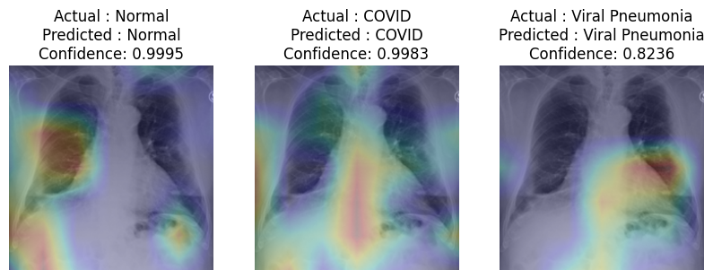
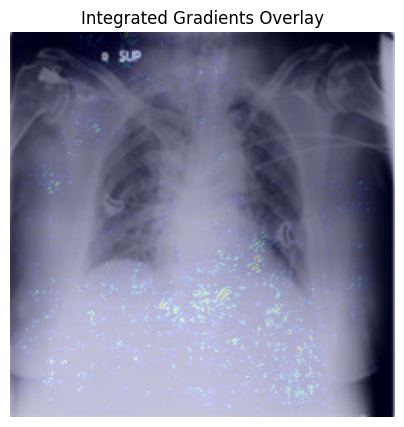
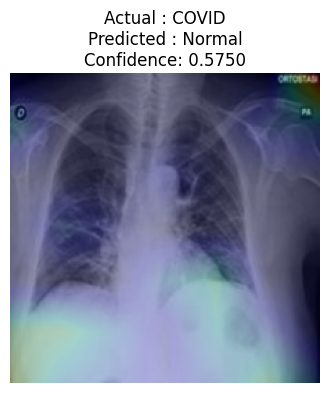

# Explainable COVID-19 X-Ray Classification using DenseNet121 and Grad-CAM

## Overview

This project presents an Explainable Artificial Intelligence (XAI) framework for automated chest X-ray classification. A fine-tuned DenseNet121 model is used to classify chest X-ray images into three categories:

- COVID-19
- Normal
- Viral Pneumonia

To improve model transparency and interpretability, Grad-CAM and Integrated Gradients are employed to visualize the regions influencing model predictions. Additionally, explanation quality is quantitatively evaluated using Entropy, Deletion AUC, and Area Over the Perturbation Curve (AOPC).

---

## Project Highlights

- Fine-tuned DenseNet121 for chest X-ray classification
- Multi-class classification (COVID-19, Normal, Viral Pneumonia)
- Explainability using:
  - Grad-CAM
  - Integrated Gradients
- Quantitative XAI evaluation:
  - Entropy Analysis
  - Deletion Metric
  - AOPC (Area Over the Perturbation Curve)
- Misclassification Analysis
- Class-wise Average Heatmap Analysis

---

## Dataset

The dataset consists of chest X-ray images belonging to three classes:

| Class | Description |
|---------|------------|
| COVID | COVID-19 positive chest X-rays |
| Normal | Healthy chest X-rays |
| Viral Pneumonia | Viral Pneumonia chest X-rays |

### Dataset Structure

```text
data/
├── train/
│   ├── COVID/
│   ├── Normal/
│   └── Viral Pneumonia/
│
├── val/
│   ├── COVID/
│   ├── Normal/
│   └── Viral Pneumonia/
│
└── test/
    ├── COVID/
    ├── Normal/
    └── Viral Pneumonia/
```

---

## Model Architecture

The classification model is based on **DenseNet121** pretrained on ImageNet.

### Architecture

```text
Input Image (224×224×3)
            │
            ▼
     DenseNet121
     (ImageNet)
            │
            ▼
 GlobalAveragePooling2D
            │
            ▼
        Dropout
            │
            ▼
      Dense Layer
       (3 Classes)
```

### Training Strategy

- Transfer Learning
- Fine-Tuning of DenseNet121
- Adam Optimizer
- Categorical Crossentropy Loss
- Data Augmentation using ImageDataGenerator

---

## Training Results

| Metric | Score |
|----------|----------|
| Training Accuracy | 98.30% |
| Validation Accuracy | 96.33% |
| Test Accuracy | 97.47% |

---

## Classification Performance

### Test Classification Report

| Class | Precision | Recall | F1-Score |
|----------|----------|----------|----------|
| COVID | 0.98 | 0.95 | 0.97 |
| Normal | 0.95 | 0.97 | 0.96 |
| Viral Pneumonia | 0.99 | 1.00 | 1.00 |

### Overall Accuracy

```text
97.47%
```

---

## Explainable AI (XAI)

### 1. Grad-CAM

Grad-CAM (Gradient-weighted Class Activation Mapping) highlights the image regions that contribute most to the model's prediction.

#### Example

<p align="center">
  
</p>

---

### 2. Integrated Gradients

Integrated Gradients provides pixel-level feature attribution by integrating gradients along a path from a baseline image to the input image.

<p align="center">
  
</p>

---

## Quantitative Evaluation of Explanations

### Entropy Analysis

Lower entropy indicates more concentrated explanations.

| Metric | Value |
|----------|----------|
| Mean Entropy | 10.49 |
| Standard Deviation | 0.25 |

---

### Deletion Metric

Measures how rapidly model confidence decreases when important pixels are progressively removed.

| Metric | Value |
|----------|----------|
| Mean Deletion AUC | 0.4479 |
| Standard Deviation | 0.3905 |

---

### AOPC

Area Over the Perturbation Curve (AOPC) measures the average confidence reduction after perturbing important regions.

| Metric | Value |
|----------|----------|
| Mean AOPC | 0.5002 |

---

## Visual Analysis

### Correctly Classified Samples

Grad-CAM visualizations indicate that the model primarily focuses on clinically relevant pulmonary regions while making predictions.

### Average Class-wise Heatmaps

Average Grad-CAM maps were generated to identify common attention patterns for:

- COVID
- Normal
- Viral Pneumonia

### Misclassification Analysis

Misclassified samples were analyzed using Grad-CAM to understand model failure cases and attention behavior.
<p align="center">
  
</p>

---

## Repository Structure

```text
Explainable-COVID19-XRay-Classification/
│
├── notebooks/
│   ├── 01_Data_Analysis.ipynb
│   ├── 02_DenseNet121_Training.ipynb
│   ├── 03_Model_Evaluation.ipynb
│   ├── 04_XAI_Methods.ipynb
│   ├── 05_XAI_Metrics.ipynb
│   └── 06_XAI_Analysis.ipynb
│
├── models/
│   └── best_densenet121.keras
│
├── reports/
│   ├── Final_Report.pdf
│   └── figures/
│
├── results/
│   ├── classification_report.txt
│   ├── entropy_results.csv
│   ├── deletion_results.csv
│   └── aopc_results.csv
│
├── requirements.txt
├── README.md
└── LICENSE
```

---

## Installation

Clone the repository:

```bash
git clone https://github.com/yourusername/Explainable-COVID19-XRay-Classification.git

cd Explainable-COVID19-XRay-Classification
```

Install dependencies:

```bash
pip install -r requirements.txt
```

---

## Technologies Used

- Python
- TensorFlow / Keras
- DenseNet121
- OpenCV
- NumPy
- Matplotlib
- Seaborn
- Scikit-Learn
- tf-explain
- tf-keras-vis

---

## Future Work

- Lung segmentation before classification
- SHAP and LIME integration
- External dataset evaluation
- Multi-disease chest X-ray classification
- Clinical decision-support system deployment

---

## Author

**Pratush Papnai**

Machine Learning | Deep Learning | Computer Vision | Explainable AI
